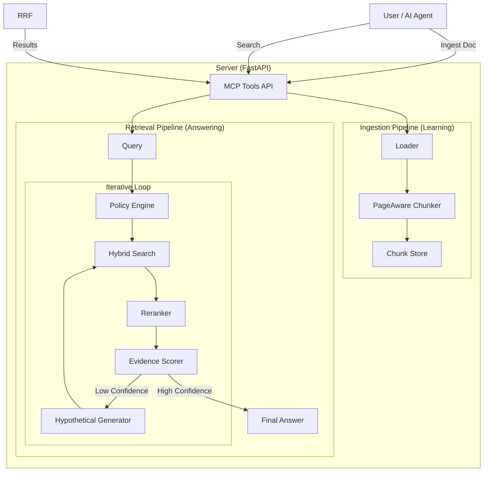

# 📘 Adaptive RAG MCP Server: A Beginner's Guide

Welcome to the **Adaptive RAG MCP Server** project! This guide is designed to explain everything about this project, from what it is to how it works, in simple terms.

---

## 1. Project Overview 🎯

### What is this project?
Imagine you have a huge library of digital documents (PDFs, text files, notes). If you asked a standard AI "What does my specific contract say about defects?", it wouldn't know because it hasn't read your files.

This project is a **smart librarian** for your files. It's a server that:
1.  **Reads** your documents (Ingestion).
2.  **Organizes** them so they are easy to search (Indexing).
3.  **Finds** the exact paragraphs relevant to your questions (Retrieval).
4.  **Connects** to other AI tools using a standard implementation called **MCP** (Model Context Protocol).
5.  **Adapts** its strategy based on your questions (Policy Engine & Iterative Refinement).

### What problem does it solve?
Standard AI models (like ChatGPT or Claude) are "frozen in time" and don't know your private data. This project solves that by providing **Retrieval-Augmented Generation (RAG)**. It "augments" (adds to) the AI's knowledge by "retrieving" (finding) your specific data before answering.

### Target Audience
-   **Developers** who want to build smart search applications.
-   **Data Scientists** extracting insights from documents.
-   **Users** who want to chat with their proprietary documents using AI agents.

---

## 2. Technology Stack 🛠️

Here are the tools we use to build this "smart librarian":

| Technology | Purpose | Why we chose it? |
| :--- | :--- | :--- |
| **Python** 🐍 | Programming Language | Easy to read, powerful for AI and data processing. |
| **FastAPI** ⚡ | Web Server | Extremely fast and easy to build APIs (websites for computers). |
| **MCP** 🔌 | Protocol | Standard way for AI models to "talk" to tools and data. |
| **Sentence-Transformers** 🧠 | AI Brain | Converts text into numbers (vectors) to understand *meaning*, not just keywords. |
| **FAISS** 🔍 | Search Engine | Facebook's library for super-fast similarity search (finding similar vectors). |
| **Rank-BM25** 🔎 | Keyword Search | Classic search algorithm (uses keywords) to double-check the AI's results. |
| **Pydantic** 🛡️ | Data Validation | Ensures all data moving through the system is correct and safe. |

---

## 3. Project Architecture 🏗️

The project handles two main jobs: **Learning (Ingestion)** and **Answering (Retrieval)**.

### High-Level Architecture Diagram



### How Components Communicate
1.  **User sends a command** (like "Read this PDF" or "Search for X") via the **MCP API**.
2.  **Ingestion Pipeline**: Breaks the document into small "chunks" (paragraphs) and saves them.
3.  **Retrieval Pipeline**: When you search, it looks up the best matching chunks using both **Meaning** (Vectors) and **Keywords** (BM25) and mixes them for the best result.

---

## 4. Directory Structure 📂

Here is what the folders contain:

-   **`src/`**: The heart of the code.
    -   **`server/`**: The "front desk". Handles incoming requests and tools.
        -   `main.py`: The entry point (starts the application).
        -   `policy.py`: The brain that decides *how* to search.
        -   `tools/`: The specific skills the server offers (e.g., `ingest_document`, `search`).
    -   **`policy/`**: The "Decision Maker".
        -   `engine.py`: Categorizes questions (e.g., "Is this a comparison?").
    -   **`ingestion/`**: The "reading room".
        -   `pipeline.py`: Manager that oversees reading and organizing files.
        -   `chunker.py`: Scissors that cut text into bite-sized pieces.
    -   **`retrieval/`**: The "search engine".
    -   **`retrieval/`**: The "search engine".
        -   `hybrid.py`: The brain that combines different search strategies.
        -   `evidence_scoring.py`: Judge that checks if an answer is good enough.
        -   `iterative_controller.py`: Manager that retries searches if they fail.
        -   `schema.py`: Definitions of what data looks like.
-   **`tools/`**: Scripts for testing or usage examples.
-   **`tests/`**: Safety checks to make sure code works.
-   **`data/`**: Where your ingested documents and indexes actually live (storage).

---

## 5. Key Files Deep Dive 🧐

### 1. `src/server/main.py`
**"The Boss"**
-   **Purpose**: Starts the web server and lists available tools.
-   **Key Function**: `call_tool`. It receives a request like "search" and routes it to the right function.
-   **For Beginners**: This is where you look if you want to add a *new* API endpoint or change how the server starts.

### 2. `src/ingestion/pipeline.py`
**"The Organizer"**
-   **Purpose**: Coordinates the loading, splitting, and saving of documents.
-   **Key Class**: `IngestionPipeline`. It runs the show: `Load -> Chunk -> Store`.
-   **Modification**: If you wanted to add support for `.docx` word files, you would add a new loader here.

### 3. `src/ingestion/chunker.py`
**"The Scissors"**
-   **Purpose**: Splits long text into smaller, meaningful pieces.
-   **Key Feature**: `PageAwareChunker`. It's smart enough to know when a page ends, so it doesn't accidentally cut a sentence in half across pages in a weird way (mostly).
-   **Why strict?**: If chunks are too big, the AI gets confused. If too small, it misses context. This file finds the balance.

### 4. `src/retrieval/hybrid.py`
**"The Detective"**
-   **Purpose**: Finds the answer using two methods.
-   **Method 1 (Dense)**: "Show me things *related* to `apple`" (finds fruit, pie, cider).
-   **Method 2 (Sparse)**: "Show me things with the exact word `apple`".
-   **Key Function**: `reciprocal_rank_fusion`. It takes the top results from both methods and ranks them to give you the absolute best matches.

### 5. `src/policy/engine.py` (New!)
**"The Strategist"**
-   **Purpose**: Looks at your question *before* searching to decide the best plan.
-   **Example**: If you ask "What is the capital of France?", it tells the system "This is general knowledge, don't look in private files."
-   **Benefit**: Saves time and computing power.

### 6. `src/retrieval/evidence_scoring.py` (New!)
**"The Judge"**
-   **Purpose**: Looks at search results and gives them a grade (A, B, C, F).
-   **Logic**: If the top result is a 95% match, it says "High Confidence". If the top result is only 20%, it flags it as "Low Confidence" so the system knows to try again.

---

## 6. Data Flow 🌊

### How data moves through the application

1.  **Ingestion Flow (Input)**
    ```
    Your PDF File 📄 
       ⬇️ 
    [Loader] extracts text
       ⬇️
    [Chunker] splits into paragraphs
       ⬇️
    [Embedder] converts text to numbers (Vectors)
       ⬇️
    [Storage] saves Text + Vectors to disk
    ```

2.  **Search Flow (Output)**
    ```
    User Question ❓
       ⬇️
    [Policy Engine] decides: "Do we need to search? What kind?"
       ⬇️ (If search needed)
    [Iterative Controller] starts the loop:
       ⬇️
       [Search] -> [Rerank] -> [Judge Evidence]
       ⬇️ (If Judge says "Bad Evidence")
       [Hypothetical Generator] invents a fake answer to find better keywords
       ⬇️ (Retry Search)
    Final Answer 💡
    ```

---

## 7. Setup & Configuration ⚙️

To get this running, you need a few things set up.

1.  **Environment Setup**: You need Python installed.
2.  **Configuration File (`.env`)**: This file holds your secrets.
    -   `ADAPTIVE_RAG_API_KEY`: A password you create to protect your server.
    -   `LOG_LEVEL`: How much detail the server prints (INFO, DEBUG, ERROR).
3.  **Installation**:
    ```bash
    uv venv               # 1. Create a virtual environment
    uv pip install -e .   # 2. Install the project
    ```

---

## 8. Entry Point & Execution Flow 🚀

### Where does it start?
The application starts at **`src/server/main.py`**.

### Step-by-Step Execution
1.  **Launch**: You run `python -m src.server.main`.
2.  **Startup**: FastAPI wakes up and loads the `tools` (like `search` and `ingest`).
3.  **Waiting**: The server sits idle, listening at `http://localhost:8000`.
4.  **Request**: You (or an AI agent) send a POST request to `/tools/search`.
5.  **Action**: The server runs the `search` function and sends back JSON data.

---

## 9. Key Features Breakdown ⭐

| Feature | Description | Implemented In |
| :--- | :--- | :--- |
| **Ingest Document** | Reads PDFs/Text and adds them to the knowledge base. | `src/ingestion/pipeline.py` |
| **Hybrid Search** | The "Secret Sauce". Combines keyword + vector search. | `src/retrieval/hybrid.py` |
| **List Tools** | Tells the AI what it can do ("I can search, ingest, delete..."). | `src/server/main.py` |
| **Reranking** | Taking the top 10 results and carefully re-scoring them for accuracy. | `src/retrieval/reranker.py` |
| **Policy Engine** | Classifies questions to choose the best search strategy. | `src/policy/engine.py` |
| **Evidence Scoring** | Mathematically proves if an answer is good or not. | `src/retrieval/evidence_scoring.py` |
| **HyDE Fallback** | "Hypothetical Document Embeddings" - invents an answer to help find the real one when stuck. | `src/retrieval/iterative_controller.py` |

---

## 10. Dependencies Explained 📦

Here are the "helpers" we imported to make this work:

-   `sentence-transformers`: The heavy lifter that understands English semantics.
-   `faiss-cpu`: A super-optimized C++ library wrapped in Python for searching vectors.
-   `rank_bm25`: A simple but effective math formula for keyword search.
-   `uvicorn`: A lightning-fast server runner for Python.
-   `google-generativeai`: Used if we want to add Google's Gemini AI models later.

---

## 11. Common Beginner Questions ❓

**Q: How do I add a new feature?**
A: 
1.  Write the logic in a new file in `src/`.
2.  Create a "Tool" wrapper in `src/server/tools/`.
3.  The server automatically detects it if you register it correctly!

**Q: Where is my data saved?**
A: It is saved in the `data/` folder. If you delete this folder, the brain "forgets" everything it read.

**Q: Why is the first search slow?**
A: The system needs to load the "AI Brain" (Sentence Transformer model) into memory. This happens once on startup or first use.

**Q: Can I use this with PDF files?**
A: Yes! The `Loader` inside `src/ingestion/loaders.py` handles PDF reading automatically.

---
*Created by the Adaptive RAG Team*
