# Adaptive RAG MCP – Production Grade Model Context Protocol Server

## 🚀 Overview

**Adaptive RAG MCP** is a production-grade implementation of the Model Context Protocol (MCP) designed to bridge Large Language Models (LLMs) with dynamic, high-fidelity context using **Adaptive Retrieval-Augmented Generation (RAG)**.

Unlike traditional RAG systems that perform naive top-k retrieval, this system uses an **intelligent policy engine** to evaluate query complexity, orchestrate multi-step retrieval strategies, and verify evidence quality before responding. It features a **Hybrid Retrieval** pipeline (Dense + Sparse), **Cross-Encoder Reranking**, and **Epistemic Safety** mechanisms to detect hallucinations.

### 🔑 Key Differentiators
- **Adaptive Routing**: Dynamically decides between direct answers, single-step retrieval, or multi-step reasoning.
- **Hybrid Search**: Combines semantic understanding (FAISS) with keyword precision (BM25).
- **Epistemic Safety**: Explicitly signals confidence levels and detects contradictions in retrieved evidence.
- **Memory Management**: Learns from past interactions to improve retrieval ranking over time.
- **Tool Discovery**: Semantic routing to relevant tools based on user intent.

---

## 🏗️ System Architecture

### High-Level Architecture
The system follows a modular architecture where the MCP Server acts as the central brain, orchestrating retrieval, reasoning, and response generation.

```mermaid
graph TD
    %% Styling
    classDef client fill:#e3f2fd,stroke:#1565c0,stroke-width:2px;
    classDef server fill:#f3e5f5,stroke:#7b1fa2,stroke-width:2px;
    classDef storage fill:#efebe9,stroke:#4e342e,stroke-width:2px;
    classDef external fill:#e8f5e9,stroke:#2e7d32,stroke-width:2px;

    User([👤 User]) <-->|Interactive CLI| Client[💻 Test Chatbot Client]:::client

    subgraph System_Boundary [Adaptive RAG MCP System]
        direction TB
        
        Client <-->|JSON-RPC / SSE| Connectivity[🔌 MCP Connection]
        
        subgraph Server_Container [Adaptive RAG Server]
            direction TB
            Connectivity --> Router{🧠 Policy Engine}
            
            Router -->|Simple Query| Direct[Direct Answer]
            Router -->|Complex Logic| Planner[📋 Task Planner]
            Router -->|Information Need| Tools[🛠️ Tool Executor]
            
            Planner --> Tools
            
            Tools --> Hybrid[🔎 Hybrid Retriever]
            Hybrid -->|Dense| VectorDB[(📦 FAISS Vector Store)]:::storage
            Hybrid -->|Sparse| KWIndex[(🗂️ BM25 Index)]:::storage
            
            VectorDB & KWIndex --> Reranker[⚖️ Cross-Encoder Reranker]
            Reranker --> Memory[(🧠 Adaptive Memory)]:::storage
        end
    end

    Reranker -->|Context| LLM((🤖 Gemini 2.0 Flash)):::external
    Direct --> LLM
    Planner --> LLM
```



---

### 🧠 Adaptive Routing Logic
The **Policy Engine** analyzes every incoming query to determine the optimal execution path.


---

## 📂 Folder Structure

The project is structured for scalability and maintainability.

```bash
adaptive_rag_mcp/
├── src/
│   ├── server/             # FastAPI & MCP Server Core
│   │   ├── main.py         # Entry point
│   │   └── tools/          # Tool definitions (Executor, Schemas)
│   ├── policy/             # Intelligent Routing & Decision Logic
│   │   ├── engine.py       # Complexity analysis engine
│   │   └── tool_discovery.py # Semantic tool routing
│   ├── retrieval/          # Search functionality
│   │   ├── hybrid.py       # BM25 + Vector fusion
│   │   ├── vector_store.py # FAISS implementation
│   │   ├── reranker.py     # Cross-encoder reranking
│   │   ├── sparse_retriever.py # BM25 implementation
│   │   ├── adaptive_memory.py # Learning from feedback
│   │   └── components/     # Low-level utilities
│   ├── ingestion/          # Document processing & PDF loaders
│   └── impl/               # Interface implementations
├── data/                   # Persistent storage (Vector DB, Indices)
├── tests/                  # Pytest suite
└── Dockerfile              # Production containerization
```

---

## 🧩 Component Breakdown

### 1. MCP Server (`src/server`)
Implements the Model Context Protocol using `fastmcp`. It exposes tools and resources types to clients (like Claude Desktop or custom chatbots) via standardized JSON-RPC over SSE (Server-Sent Events).

### 2. Adaptive Router (`src/policy`)
Uses a lightweight LLM call to classify queries into complexity bands:
- **Direct**: No retrieval needed (e.g., "Hello").
- **Retrieval**: Needs external data (e.g., "Summarize this PDF").
- **Reasoning**: Needs multi-step planning (e.g., "Compare X and Y and suggest Z").

### 3. Hybrid Retriever (`src/retrieval`)
Combines two search strategies best-of-breed results:
- **Dense Retrieval (FAISS)**: Captures semantic meaning (e.g., "machine learning types" ≈ "supervised/unsupervised").
- **Sparse Retrieval (BM25)**: Captures exact keyword matches (e.g., acronyms, specific IDs).

### 4. Reranking & Compression
- **Cross-Encoder**: Re-scores top candidates using a high-accuracy transformer model to ensure relevance.
- **Context Compressor**: Removes redundant or irrelevant text segments to fit within the LLM's context window efficiently.

### 5. Memory Manager (`adaptive_memory.py`)
Tracks successful retrievals. If a specific document chunk was useful for a past query, it gets a "boost" in future similar searches, allowing the system to learn over time.

---

## 🛠️ Setup Instructions

### Prerequisites
- Python 3.10+
- Docker
- Gemini API Key

### 1. Environment Setup
Create a `.env` file in the root `adaptive_rag_mcp` folder:
```env
GEMINI_API_KEY=your_gemini_key_here
LOG_LEVEL=INFO
```

### 2. Run with Docker (Recommended)
Build and run the MCP server in a container.

```bash
# Build the image
docker build -t adaptive-rag .

# Run the container
docker run -d -p 8000:8000 --env-file .env --name adaptive-rag-server adaptive-rag
```

### 3. Run Locally (Development)
```bash
# Install dependencies using uv
uv sync

# Activate virtual environment
source .venv/bin/activate  # or .venv\Scripts\activate on Windows

# Start the server
python -m src.server.main
```

### 4. Running the Test Chatbot
Navigate to the sibling `test chatbot` directory:
```bash
cd ../test\ chatbot
uv sync
python src/chatbot.py
```
*Note: Ensure the chatbot's `.env` points to the running MCP server URL.*

---

## 🔄 Retrieval Pipeline Diagram


---

## 💡 Example Query Flow

**User Question**: *"What are the safety protocols mentioned in the Q2 report?"*

1.  **Ingestion**: Server receives the query.
2.  **Policy**: Engine determines **Medium Complexity** (requires retrieval). - *Route: Retrieval*
3.  **Search**:
    *   **Vector**: Finds chunks semantically related to "safety protocols", "security".
    *   **BM25**: Finds chunks with exact text "Q2 report", "safety".
4.  **Reranking**: The system merges 20 results, reranks them, and selects the top 5 most relevant.
5.  **Reasoning**: LLM analyzes the 5 chunks.
6.  **Response**: *"The Q2 report outlines three key safety protocols: 1. Mandatory PPE... 2. Hourly checks..."*

---

## 🔮 Advanced Capabilities

*   **Self-Corrective RAG**: If the retrieved documents don't answer the question (low confidence score), the system automatically triggers a **Query Expansion** step to try finding better information.
*   **Hallucination Detection**: The `EpistemicSafety` module checks for contradictions between the generated answer and the source documents.
*   **Long-Context Optimization**: Uses smart summarization to compress broad contexts into essential facts before feeding them to the generation model.

## 🗺️ Future Roadmap

- [ ] **GraphRAG Integration**: adding Knowledge Graph traversal for deep reasoning.
- [ ] **Multi-Modal Support**: Ingesting and retrieving images/charts from PDFs.
- [ ] **Streaming Responses**: Full token streaming support for the chatbot interface.
- [ ] **User Auth**: Adding OAuth2 for secure multi-user environments.

---

**Built for High-Performance AI Systems.**
