# Adaptive RAG Test Chatbot

A production-grade CLI Chatbot designed to interact with the **Adaptive RAG MCP Server**. This tool allows you to:
1.  **Ingest Documents**: Upload PDFs and text files to the MCP knowledge base.
2.  **Test Retrieval**: Verify the hybrid search (Dense + Sparse) and reranking.
3.  **End-to-End Q&A**: Ask complex questions to test the Adaptive RAG pipeline.

## 🚀 Quick Start

### 1. Prerequisites
*   **Python 3.10+**
*   **MCP Server Running** (See `../adaptive_rag_mcp/README.md`)
*   **Gemini API Key** (for local answer generation)

### 2. Installation
Navigate to the `test chatbot` directory and install dependencies:

```bash
cd "D:\MCP\test chatbot"

# Using uv (Recommended)
uv sync
```

### 3. Configuration
Create a `.env` file in `D:\MCP\test chatbot\` (copy from example if available):

```ini
# Chatbot Configuration
GEMINI_API_KEY=your_gemini_key_here
MCP_SERVER_URL=http://localhost:8000
```

### 4. Running the Chatbot
Activate the environment and start the CLI:

```bash
# Windows
.venv\Scripts\activate
python src/chatbot.py

# Mac/Linux
source .venv/bin/activate
python src/chatbot.py
```

---

## 🏗️ Architecture

The chatbot acts as a **smart client** that connects to the MCP Server over HTTP/SSE.

```mermaid
graph TD
    User([👤 User]) -->|Commands / Questions| Chatbot[💻 CLI Application]
    
    subgraph Client_Side [Chatbot Logic]
        Chatbot -->|Local Processing| PDF[📄 PDF Extractor]
        Chatbot -->|LLM Inference| Gemini((🤖 Gemini 2.0 Flash))
    end
    
    subgraph Server_Side [Adaptive RAG MCP]
        Chatbot <-->|HTTP JSON-RPC| Server[🌍 MCP Server]
        Server -->|Ingest/Search| KnowledgeBase[(📚 Knowledge Base)]
    end
```



---

## 🧪 Testing Workflow

### Scenario: Ingesting a PDF
You can test the system by generating a sample PDF and asking questions about it.

1.  **Generate Sample Data**:
    ```bash
    python scripts/generate_sample_pdf.py
    # Creates data/machine_learning_basics.pdf
    ```

2.  **Start Chatbot**:
    ```bash
    python src/chatbot.py
    ```

3.  **Run Commands**:
    ```text
    > /load data/machine_learning_basics.pdf
    ✅ Successfully ingested 'machine_learning_basics.pdf' (Chunked into 5 parts).

    > What are the three types of machine learning?
    🤖 [Thinking]... Retrieving context from MCP...
    
    Based on the document, the three types are:
    1. Supervised Learning
    2. Unsupervised Learning
    3. Reinforcement Learning
    ```

---

## 📚 Command Reference

| Command | Description | Example |
| :--- | :--- | :--- |
| `/load <path>` | Ingests a local PDF or Text file into the MCP server. | `/load ./data/report.pdf` |
| `/list` | Lists all documents currently indexed in the server. | `/list` |
| `/stats` | Displays server-side ingestion and retrieval statistics. | `/stats` |
| `/clear` | Clears the current conversation history. | `/clear` |
| `/quit` | Exits the application. | `/quit` |

---

## 🔧 Troubleshooting

### "Connection Refused"
*   **Cause**: The MCP Server is not running.
*   **Fix**: 
    1.  Open a new terminal.
    2.  Go to `../adaptive_rag_mcp`.
    3.  Run `docker run -p 8000:8000 ...` or `python -m src.server.main`.

### "API Key Invalid"
*   **Cause**: `GEMINI_API_KEY` is missing or incorrect.
*   **Fix**: Check your `.env` file in the `test chatbot` directory.

### "No module named..."
*   **Cause**: Virtual environment not activated.
*   **Fix**: Run `.venv\Scripts\activate` (Windows) or `source .venv/bin/activate` (Mac/Linux).

---

## 📝 License
MIT
